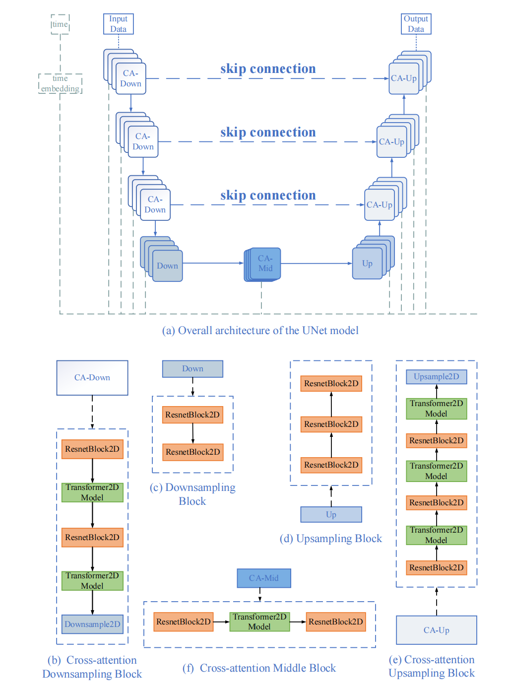
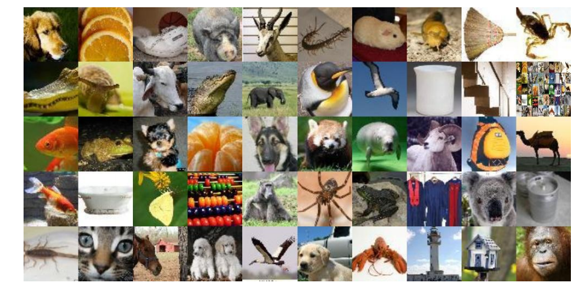
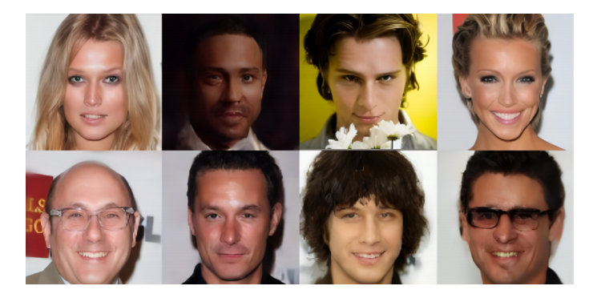

<h1 align="center">LDMOES</h1>

<p align="center">
  <b>Lightweight Diffusion Models Based on Multi-Objective Evolutionary Neural Architecture Search</b>
</p>

<p align="center">
  <i>Official Implementation &nbsp;|&nbsp; International Journal of Neural Systems (2025)</i>
</p>

---

> **Abstract.** Diffusion models achieve excellent image generation quality, but their
> iterative denoising process and complex backbone networks introduce significant
> computational costs. This work proposes **LDMOES**, an automated architecture
> optimization framework that combines multi-objective evolutionary neural architecture
> search (NAS), knowledge distillation, weight-sharing supernet training, and dynamic
> joint loss optimization, to automatically discover lightweight diffusion architectures
> with a better trade-off between **generation quality** and **computational efficiency**.

---

## Table of Contents

- [Overview](#overview)
- [Framework Overview](#framework-overview)
- [Model Architecture](#model-architecture)
- [Main Contributions](#main-contributions)
- [Experimental Results](#experimental-results)
- [Repository Structure](#repository-structure)
- [Installation](#installation)
- [Training](#training)
- [Citation](#citation)
- [License](#license)

---

## Overview

Diffusion models deliver state-of-the-art image synthesis, but the cost of the
iterative denoising process and the heavy UNet backbone restricts their deployment
in resource-constrained scenarios. Manually designing lightweight backbones is
error-prone and cannot fully explore the design space.

**LDMOES** reformulates diffusion architecture design as a *multi-objective
optimization problem* and solves it with an evolutionary search that jointly
considers:

- **Multi-objective evolutionary NAS** — a Pareto-optimal search over lightweight diffusion backbones
- **Knowledge distillation** — compression guided by a pretrained teacher model
- **Weight-sharing supernet training** — efficient evaluation of many candidate architectures
- **Dynamic joint loss optimization** — balancing teacher guidance and noise prediction learning

<div align="center">

### Highlights

- 🏆 **First** multi-objective evolutionary NAS framework for lightweight diffusion models
- 🎯 Automatically discovers architectures with ~40%–60% MAC reduction
- 📈 Improves or maintains FID while substantially cutting computational cost

</div>

---

## Framework Overview

<div align="center">
  
  <br>
  <b>Figure 1.</b> Overview of the LDMOES framework. The pipeline proceeds through
  three stages: student supernet training, multi-objective evolutionary architecture
  search, and subnet retraining.
</div>

The proposed LDMOES framework contains three major stages.

### Stage 1 — Student Supernet Training

A compact **student supernet** is constructed from a pretrained teacher diffusion
model. The student network inherits the hierarchical UNet structure while reducing
redundant components. Through **weight sharing**, different candidate architectures
can be efficiently evaluated without training each model independently.

### Stage 2 — Multi-Objective Evolutionary Architecture Search

<div align="center">
  
  <br>
  <b>Figure 2.</b> Architecture encoding used in the evolutionary search.
</div>

LDMOES formulates diffusion architecture optimization as a multi-objective
optimization problem:

- **Minimize** computational complexity (MACs)
- **Minimize** noise prediction error

The framework employs **NSGA-II** to search the Pareto-optimal architecture set.

### Stage 3 — Subnet Retraining

The searched subnet is retrained using a **dynamic joint loss**:

$$
L = (1-\beta) \, L_{dis} + \beta \, L_{predict}
$$

where `L_dis` is the distillation loss from the teacher and `L_predict` is the
diffusion noise-prediction loss. The weight `β` increases during training, which
enables:

- **Early stage** — knowledge transfer from the teacher model
- **Later stage** — optimization of diffusion noise prediction ability

---

## Model Architecture

<div align="center">
  
  <br>
  <b>Figure 3.</b> The UNet-based diffusion backbone that defines the search space.
</div>

The search space is built upon a **UNet-based diffusion backbone**. The architecture
search considers:

- Residual block configurations
- Convolution kernel sizes
- Channel scaling factors

The modular search strategy reduces the complexity of architecture exploration and
improves search efficiency.

---

## Main Contributions

- **First multi-objective evolutionary NAS framework for lightweight diffusion
  models.**
- **Knowledge distillation based compression strategy for diffusion architecture
  optimization.**
- **Dynamic loss scheduling mechanism** balancing teacher guidance and noise
  prediction learning.

---

## Experimental Results

LDMOES is evaluated on:

- **CIFAR-10**
- **Tiny-ImageNet**
- **CelebA-HQ 256×256**
- **LSUN-church 256×256**

### Pixel-space Generation

<div align="center">
  
  <br>
  <b>Figure 4.</b> Qualitative pixel-space generation results.
</div>

**Results on CIFAR-10:**

| Model        | MACs   | FID   |
|--------------|--------|-------|
| DDIM Teacher | 6.10G  | 4.67  |
| LDMOES-S1    | 3.72G  | 4.13  |
| LDMOES-S2    | 4.08G  | **3.32** |

LDMOES achieves approximately **40% computational reduction** while maintaining or
improving generation quality.

### Latent-space Generation

<div align="center">
  
  <br>
  <b>Figure 5.</b> Qualitative latent-space generation results.
</div>

**Results on CelebA-HQ 256×256:**

| Model      | MAC Reduction | FID   |
|------------|---------------|-------|
| Teacher LDM| —             | 5.11  |
| LDMOES-S3  | 48%           | **4.09** |
| LDMOES-S4  | 50%           | 5.15  |

On LSUN-church 256×256, LDMOES reduces computational cost by approximately
**55%–60%** while preserving competitive generation performance.

---

## Repository Structure

```text
LDMOES/
├── configs/       # configuration files for training / search / inference
├── datasets/      # data loading utilities
├── models/        # UNet backbone and supernet definitions
├── search/        # evolutionary search (encoding, crossover, NSGA-II)
├── train/         # supernet / subnet training scripts
├── evaluation/    # FID & MACs evaluation
└── README.md
```

---

## Installation

```bash
pip install -r requirements.txt
```

Requirements:

- Python ≥ 3.8
- PyTorch
- CUDA ≥ 11.x

---

## Training

### 1. Train Supernet

```bash
python train_supernet.py
```

### 2. Architecture Search

```bash
python search.py
```

### 3. Retrain Searched Model

```bash
python train_subnet.py
```

---

## Citation

If you find this work useful in your research, please cite:

```bibtex
@article{xue2025ldmoes,
  title={Lightweight Diffusion Models Based on Multi-Objective Evolutionary Neural Architecture Search},
  author={Xue, Yu and Jiao, Chunxiao and Zhang, Yong and Mohamed, Ali Wagdy and Mansour, Romany Fouad and Neri, Ferrante},
  journal={International Journal of Neural Systems},
  year={2025}
}
```

---

## License

This project is released for research purposes.
